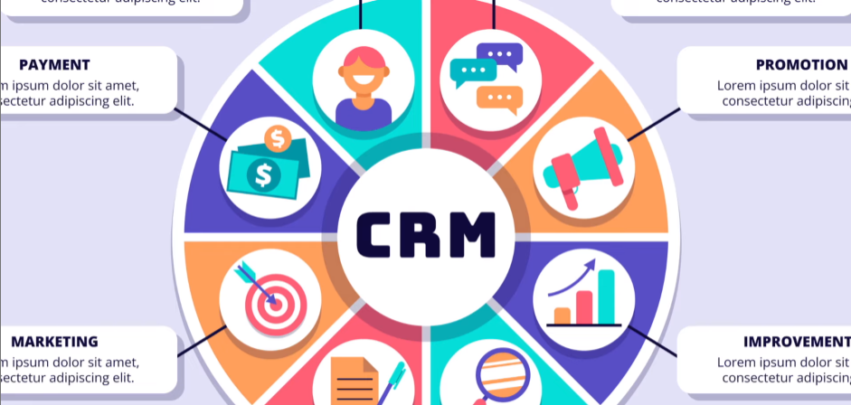
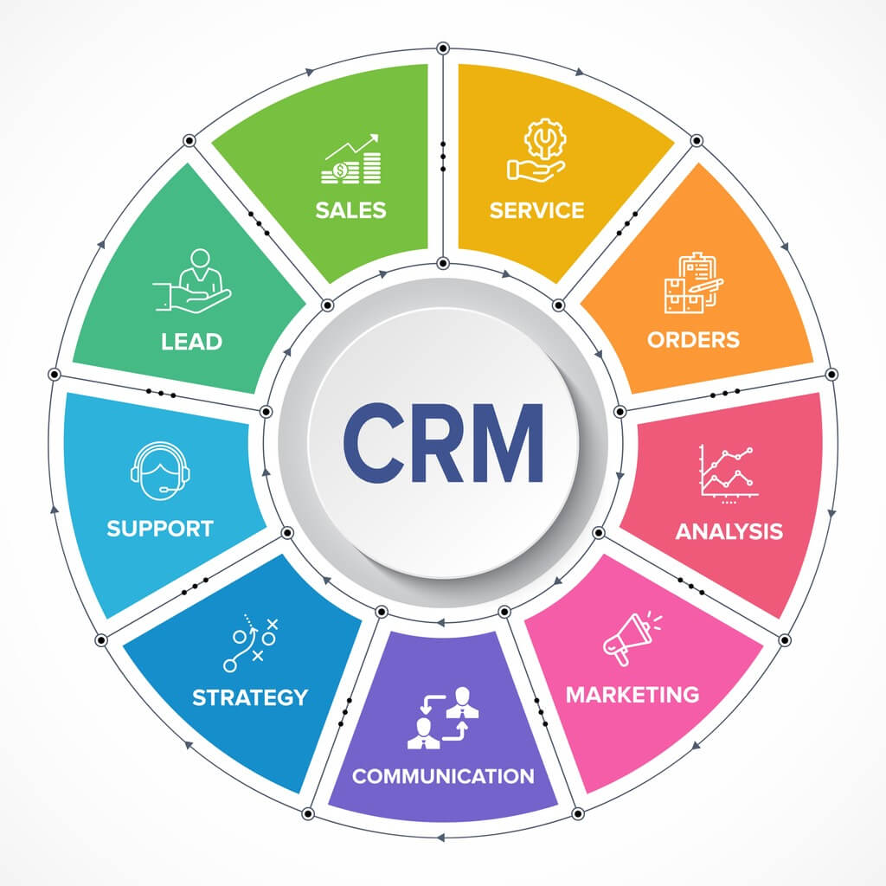
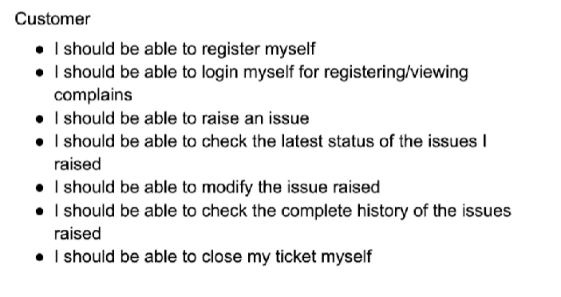
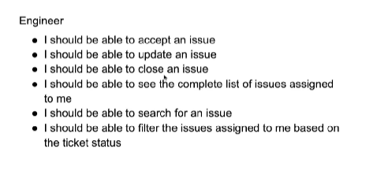
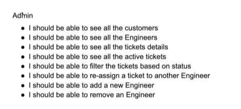
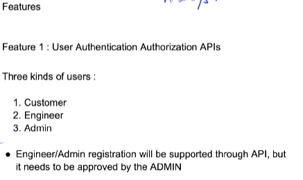

# CRM-APP
CRM-APPLICATION-NOV-2025

# ------------------

# ------------------

# ------------------

Day-1:
 * How to set up the backend architecture for a scalable CRM
 *  Designing an efficient and secure User Schema using Mongoose (or your preferred ORM)
 * Structuring your project for real-world maintainability
 * Preparing for features like authentication, role management & user profiles

# ------------------------

Customer Use-cases: [See Only His Tickets]

# ------------------------

Engineer Use Cases: [In company / application]

# ------------------------

Admin Use-Cases:

# ------------------------

Features

# ------------------------

# ------------------------